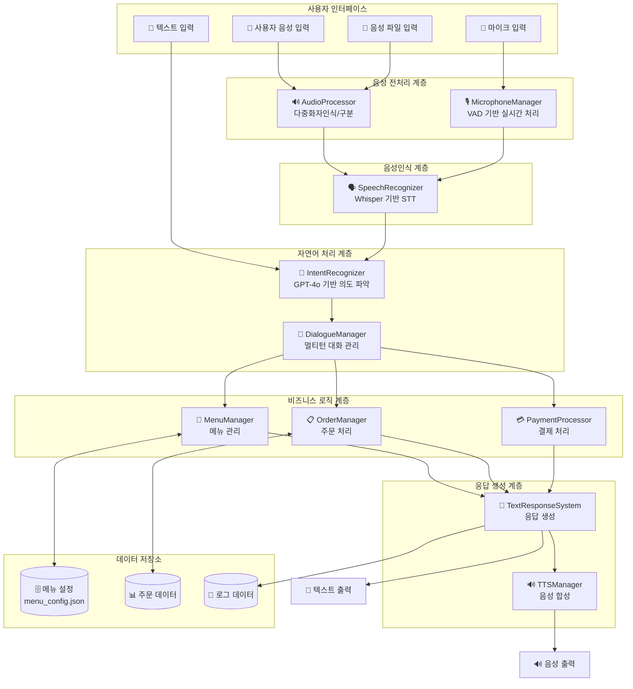
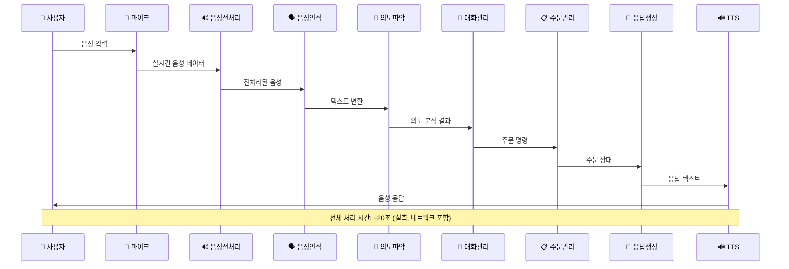
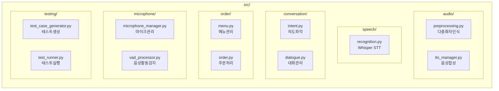
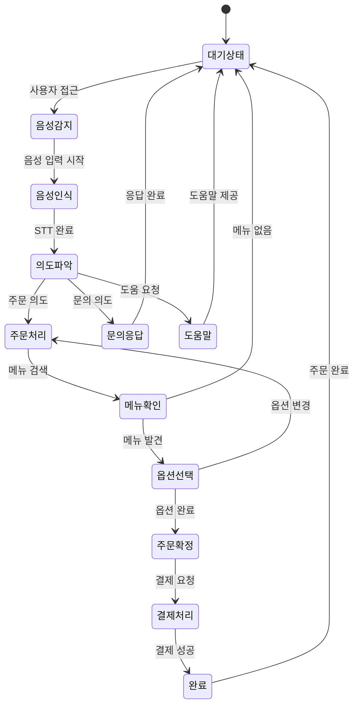
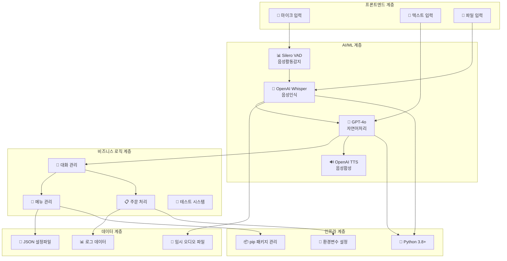
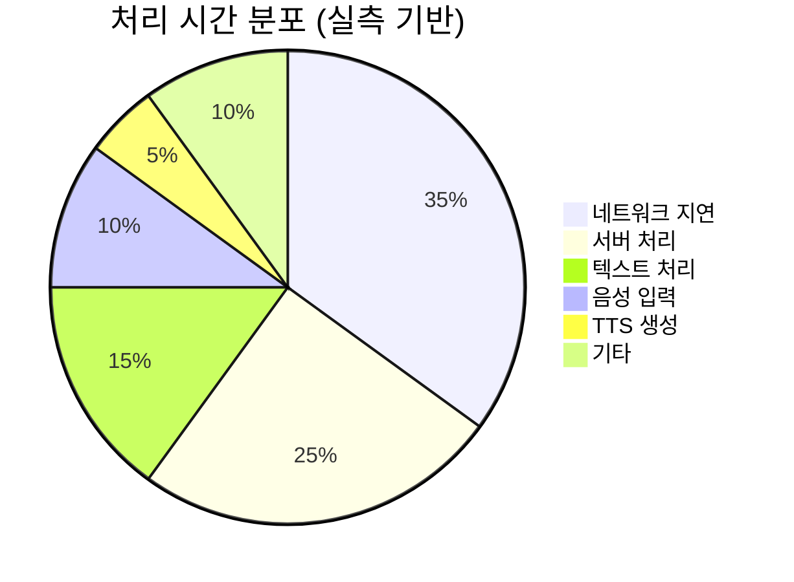

# 음성 기반 키오스크 AI 주문 시스템 - 아키텍처 시각화

## 1. 전체 시스템 아키텍처



## 2. 데이터 흐름 다이어그램



## 3. 모듈별 상세 구조



## 4. 키오스크 사용 시나리오



## 5. 기술 스택 구성도



## 6. 성능 및 품질 지표



```mermaid
xychart-beta
    title "처리 시간 분석 (초)"
    x-axis [음성입력, 네트워크전송, 서버처리, TTS생성, 텍스트처리, 메뉴로딩]
    y-axis "처리시간" 0 --> 2
    bar [2.0, 5.0, 7.0, 1.0, 3.0, 2.0]
```
