# 음성 기반 키오스크 AI 주문 시스템 - 아키텍처 시각화

## 1. 전체 시스템 아키텍처

```mermaid
graph TB
    subgraph "사용자 인터페이스"
        A[👤 사용자 음성 입력]
        B[📝 텍스트 입력]
        C[📁 음성 파일 입력]
        D[🌐 API 클라이언트]
    end
    
    subgraph "API 서버 계층"
        E[🚀 FastAPI 서버<br/>HTTP/WebSocket]
        F[🔒 보안 미들웨어<br/>인증/속도제한]
        G[📊 모니터링<br/>성능/오류 추적]
    end
    
    subgraph "음성 전처리 계층"
        H[🔊 AudioProcessor<br/>다중화자인식/구분]
    end
    
    subgraph "음성인식 계층"
        I[🗣️ SpeechRecognizer<br/>Whisper 기반 STT]
    end
    
    subgraph "자연어 처리 계층"
        J[🧠 IntentRecognizer<br/>GPT-4o 기반 의도 파악]
        K[💬 DialogueManager<br/>멀티턴 대화 관리]
    end
    
    subgraph "비즈니스 로직 계층"
        L[🍔 Menu<br/>메뉴 관리]
        M[📋 OrderManager<br/>주문 처리]
    end
    
    subgraph "응답 생성 계층"
        N[📝 TextResponseSystem<br/>응답 생성]
        O[🔊 TTSManager<br/>음성 합성]
    end
    
    subgraph "테스트 시스템"
        P[🧪 TestCaseGenerator<br/>자동 테스트 생성]
        Q[📊 TestRunner<br/>테스트 실행]
        R[📈 ReportGenerator<br/>결과 분석]
    end
    
    subgraph "데이터 저장소"
        S[(🗄️ 메뉴 설정<br/>menu_config.json)]
        T[(📊 주문 데이터)]
        U[(📝 로그 데이터)]
        V[(🧪 테스트 결과)]
    end
    
    A --> E
    B --> E
    C --> E
    D --> E
    
    E --> F
    E --> G
    E --> H
    
    H --> I
    I --> J
    J --> K
    K --> L
    K --> M
    
    L --> N
    M --> N
    N --> O
    
    P --> Q
    Q --> R
    
    L <--> S
    M <--> T
    N --> U
    R --> V
    
    O --> W[🔊 음성 출력]
    N --> X[📱 텍스트 출력]
```

## 2. 데이터 흐름 다이어그램

```mermaid
sequenceDiagram
    participant U as 👤 사용자
    participant C as 📱 클라이언트
    participant API as 🚀 API서버
    participant P as 🎯 파이프라인
    participant A as 🔊 음성전처리
    participant S as 🗣️음성인식
    participant I as 🧠 의도파악
    participant D as 💬 대화관리
    participant O as 📋 주문관리
    participant R as 📝 응답생성
    
    U->>C: 음성 파일 업로드
    C->>API: HTTP POST /process-voice
    API->>P: VoiceKioskPipeline 호출
    P->>A: 음성 전처리
    A->>S: Whisper 음성인식
    S->>I: GPT-4 의도파악
    I->>D: 대화 처리
    D->>O: 주문 관리
    O->>R: 응답 생성
    R->>P: 처리 결과
    P->>API: JSON 응답
    API->>C: HTTP Response
    C->>U: 텍스트/음성 출력
    
    Note over U,C: 전체 처리 시간: 대략 20초 (실측, API 기반)
```

## 3. 모듈별 상세 구조

```mermaid
graph LR
    subgraph "src/"
        subgraph "api/"
            API1[server.py<br/>FastAPI 서버]
            API2[security.py<br/>보안 미들웨어]
            API3[monitoring.py<br/>모니터링]
        end
        
        subgraph "audio/"
            A1[preprocessing.py<br/>다중화자인식]
            A2[tts_manager.py<br/>음성합성]
        end
        
        subgraph "speech/"
            S1[recognition.py<br/>Whisper STT]
        end
        
        subgraph "conversation/"
            C1[intent.py<br/>의도파악]
            C2[dialogue.py<br/>대화관리]
        end
        
        subgraph "order/"
            O1[menu.py<br/>메뉴관리]
            O2[order.py<br/>주문처리]
        end
        
        subgraph "response/"
            R1[text_response.py<br/>응답생성]
            R2[formatter.py<br/>응답포맷팅]
        end
        
        subgraph "testing/"
            T1[test_case_generator.py<br/>테스트생성]
            T2[test_runner.py<br/>테스트실행]
            T3[report_generator.py<br/>보고서생성]
        end
        
        subgraph "models/"
            M1[*.py<br/>데이터모델]
        end
        
        subgraph "utils/"
            U1[*.py<br/>유틸리티]
        end
    end
```

## 4. 키오스크 사용 시나리오

```mermaid
stateDiagram-v2
    [*] --> 서버대기
    서버대기 --> 요청수신 : API 요청
    요청수신 --> 파일검증 : 음성 파일 업로드
    파일검증 --> 음성인식 : 검증 통과
    파일검증 --> 오류응답 : 검증 실패
    
    음성인식 --> 의도파악 : STT 완료
    의도파악 --> 주문처리 : 주문 의도
    의도파악 --> 문의응답 : 문의 의도
    의도파악 --> 도움말 : 도움 요청
    의도파악 --> 테스트모드 : 테스트 실행
    
    주문처리 --> 메뉴확인 : 메뉴 검색
    메뉴확인 --> 옵션선택 : 메뉴 발견
    옵션선택 --> 주문확정 : 옵션 완료
    주문확정 --> 결제처리 : 결제 요청
    결제처리 --> 완료응답 : 결제 성공
    
    문의응답 --> 완료응답 : 응답 완료
    도움말 --> 완료응답 : 도움말 제공
    테스트모드 --> 완료응답 : 테스트 완료
    완료응답 --> 서버대기 : JSON 응답
    오류응답 --> 서버대기 : 오류 JSON
    
    메뉴확인 --> 완료응답 : 메뉴 없음
    옵션선택 --> 주문처리 : 옵션 변경
```

## 5. 기술 스택 구성도

```mermaid
graph TB
    subgraph "클라이언트 계층"
        F1[📱 웹 클라이언트]
        F2[📝 CLI 인터페이스]
        F3[📁 파일 업로드]
        F4[🔧 디버그 도구]
    end
    
    subgraph "API 서버 계층"
        API1[🚀 FastAPI<br/>웹 서버]
        API2[🔒 보안 미들웨어<br/>인증/속도제한]
        API3[📊 모니터링<br/>성능/오류 추적]
    end
    
    subgraph "AI/ML 계층"
        AI1[🤖 OpenAI Whisper<br/>음성인식]
        AI2[🧠 GPT-4o<br/>자연어처리]
        AI3[🔊 OpenAI TTS<br/>음성합성]
    end
    
    subgraph "비즈니스 로직 계층"
        BL1[🍔 메뉴 관리]
        BL2[📋 주문 처리]
        BL3[💬 대화 관리]
        BL4[🧪 테스트 시스템]
    end
    
    subgraph "데이터 계층"
        D1[📄 JSON 설정파일]
        D2[📊 로그 데이터]
        D3[🎵 임시 오디오 파일]
        D4[📈 테스트 결과]
    end
    
    subgraph "인프라 계층"
        I1[🐍 Python 3.8+]
        I2[📦 FastAPI/Uvicorn]
        I3[🔧 환경변수 설정]
    end
    
    F1 --> API1
    F2 --> API1
    F3 --> API1
    F4 --> BL4
    
    API1 --> API2
    API2 --> API3
    API3 --> AI1
    AI1 --> AI2
    AI2 --> BL3
    BL3 --> BL1
    BL3 --> BL2
    AI2 --> AI3
    
    BL1 --> D1
    BL2 --> D2
    AI1 --> D3
    BL4 --> D4
    
    API1 --> I2
    AI1 --> I1
    AI2 --> I1
    BL1 --> I3
```

## 6. 성능 및 품질 지표

```mermaid
pie title 처리 시간 분포 (실측 기반)
    "서버 처리" : 35
    "네트워크 전송" : 25
    "텍스트 처리" : 15
    "음성 입력" : 10
    "메뉴 로딩" : 10
    "TTS 생성" : 5
```

```mermaid
xychart-beta
    title "처리 시간 분석 (초)"
    x-axis ["음성입력", "네트워크전송", "서버처리", "TTS생성", "텍스트처리", "메뉴로딩"]
    y-axis "처리시간" 0 --> 10
    bar [2.0, 5.0, 7.0, 1.0, 3.0, 2.0]
```

