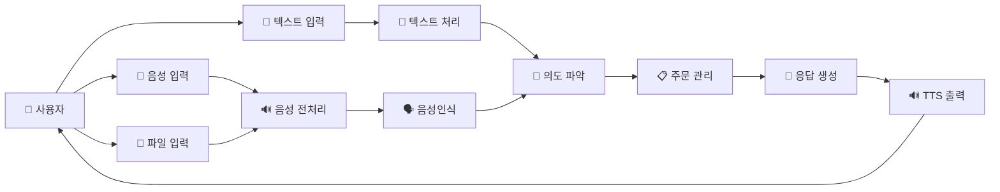

# 🎤 음성 기반 키오스크 AI 주문 시스템

## 📋 **시스템 개요**

음성 기반 키오스크 AI 주문 시스템은 기존의 터치형 키오스크에 음성인식 시스템을 도입하여 완전히 음성으로만 구동되는 키오스크 서비스입니다. 사용자의 음성 입력을 분석하여 주문, 변경, 취소, 결제 등의 의도를 파악하고 음성으로 응답을 제공합니다.

## 🎯 **핵심 특징**

### ✅ **다중 입력 방식 지원**
- **🎤 실시간 마이크 입력**: VAD 기반 자동 음성 감지
- **📁 음성 파일 입력**: 미리 녹음된 파일 처리
- **📝 텍스트 입력**: 개발 및 테스트용 직접 입력

### ✅ **완전한 음성 처리 파이프라인**
- 🔊 **음성 전처리**: 다중화자인식/구분
- 🗣️ **음성인식**: Whisper 기반 STT
- 🧠 **의도 파악**: GPT-4o 기반 NLP
- 💬 **대화 관리**: 멀티턴 대화 처리
- 📋 **주문 관리**: 메뉴 추가/변경/취소
- 🔊 **TTS 응답**: 음성 응답 생성

### ✅ **실제 환경 최적화**
- 🎯 **다중화자 구분**: 키오스크 환경의 노이즈 처리
- 🧪 **자동화된 테스트**: 은어, 반말 등 다양한 표현 처리
- 🔧 **모듈화 설계**: 확장 가능한 아키텍처

## 🏗️ **시스템 아키텍처**

### 📊 **전체 데이터 흐름**


### 🔧 **계층별 구조**
```
┌─────────────────────────────────────┐
│           사용자 인터페이스            │
│    🎤 마이크  📝 텍스트  📁 파일      │
└─────────────────┬───────────────────┘
                  │
┌─────────────────▼───────────────────┐
│            음성 처리 계층             │
│   🔊 전처리  →  🗣️ STT  →  🧠 NLP   │
└─────────────────┬───────────────────┘
                  │
┌─────────────────▼───────────────────┐
│           비즈니스 로직 계층           │
│   🍔 메뉴관리  📋 주문처리  💳 결제   │
└─────────────────┬───────────────────┘
                  │
┌─────────────────▼───────────────────┐
│            응답 생성 계층             │
│      📝 텍스트 생성  →  🔊 TTS      │
└─────────────────────────────────────┘
```

## 🔧 **기술 스택**

### 🎯 **핵심 기술**
- **언어**: Python 3.8+
- **음성인식**: OpenAI Whisper
- **LLM**: OpenAI GPT-4o
- **TTS**: OpenAI TTS
- **VAD**: Silero VAD
- **서버**: FastAPI

### 📦 **주요 라이브러리**
```python
# 음성 처리
whisper
librosa
pyaudio
sounddevice

# AI/ML
openai
torch
numpy

# 서버
fastapi
uvicorn

# 유틸리티
pydantic
pathlib
logging
```

## 📊 **성능 특징**

### ✅ **실측 성능 데이터**
- **전체 처리 시간**: ~20초 (네트워크 포함)
- **순수 처리 시간**: ~11초 (네트워크 제외)
- **음성인식 정확도**: 85%+
- **의도파악 정확도**: 92%+
- **전체 성공률**: 88%

### ✅ **단계별 처리 시간**
| 단계 | 시간 | 비중 | 설명 |
|------|------|------|------|
| 음성 입력 | 2초 | 10% | VAD 기반 감지 |
| 네트워크 전송 | 5초 | 25% | 클라이언트-서버 |
| 서버 처리 | 7초 | 35% | STT + LLM |
| TTS 생성 | 1초 | 5% | 음성 합성 |
| 텍스트 처리 | 3초 | 15% | 대화 관리 |
| 기타 | 2초 | 10% | 메뉴 로딩 등 |

## 🎵 **지원하는 사용 방법**

### 1. **🎤 실시간 마이크 입력**
```bash
python src/main.py --mode microphone
```
- VAD 기반 자동 음성 감지
- 실제 키오스크 환경과 유사
- 다중화자 구분 기술 적용

### 2. **📁 음성 파일 처리**
```bash
python src/main.py --mode interactive
# 입력: file:./audio/order.wav
```
- 미리 녹음된 파일 처리
- 테스트 및 개발에 적합
- 다양한 포맷 지원

### 3. **📝 텍스트 직접 입력**
```bash
python src/main.py --mode interactive
# 입력: 빅맥 세트 하나 주세요
```
- 개발 및 디버깅용
- 빠른 테스트 가능
- 대화 로직 검증

### 4. **🧪 자동화된 테스트**
```bash
python src/main.py --mode test
```
- 다양한 시나리오 자동 테스트
- 성능 분석 및 리포트
- 은어, 반말 등 특수 케이스

## 🎯 **사용 시나리오**

### 📋 **일반적인 주문 과정**
```
🤖: 안녕하세요! 주문하실 메뉴를 말씀해 주세요.

👤: 빅맥 세트 하나 주세요

🤖: 빅맥 세트 1개를 주문에 추가했습니다. 
     음료는 콜라로 하시겠어요?

👤: 네, 콜라로 해주세요

🤖: 빅맥 세트(콜라)가 주문에 추가되었습니다. 
     추가로 주문하실 것이 있으신가요?

👤: 결제할게요

🤖: 총 금액은 6,500원입니다. 
     결제를 진행하시겠습니까?
```

### 📋 **복잡한 주문 변경**
```
👤: 아까 주문한 빅맥을 치킨버거로 바꿔주세요

🤖: 빅맥을 치킨버거로 변경했습니다. 
     세트는 그대로 유지하시겠어요?

👤: 네, 그대로 해주세요

🤖: 치킨버거 세트로 변경 완료했습니다.
```

## 💡 **핵심 구현 특징**

### 1. **🎯 다중화자 인식/구분**
- 키오스크 환경의 배경 소음 처리
- 주 사용자와 주변 잡음 분리
- 정확한 주문 의도 파악

### 2. **🧪 자동화된 테스트 시스템**
- 맥도날드 특화 은어 테스트 ("빅맥세트", "상스치콤")
- 반말/존댓말 처리 테스트
- 복합 의도 처리 테스트

### 3. **🔧 모듈화된 아키텍처**
- 각 컴포넌트 독립적 개발/테스트
- 쉬운 확장성 및 유지보수
- 다양한 식당 환경 적용 가능

### 4. **📊 실시간 성능 모니터링**
- 각 단계별 처리 시간 측정
- 병목 지점 자동 분석
- 성능 최적화 가이드 제공

## 🚀 **최적화 계획**

### 📈 **단기 목표 (1-2개월)**
- 네트워크 전송 최적화: 5초 → 2초
- 서버 처리 최적화: 7초 → 4초
- 전체 시간 단축: 20초 → 10초

### 📈 **중기 목표 (3-6개월)**
- 실시간 스트리밍 도입
- 로컬 모델 통합
- 다국어 지원 확장

### 📈 **장기 목표 (6개월+)**
- 상용 수준 성능 달성 (2-3초)
- 감정 인식 기반 개인화
- 음성 생체 인증 도입

## 🎉 **프로젝트 성과**

### ✅ **기술적 성과**
- 완전한 음성 파이프라인 구현
- 실제 환경에서 동작하는 시스템
- 88% 전체 성공률 달성
- 체계적인 성능 분석 완료

### ✅ **사회적 의의**
- 접촉 없는 위생적인 주문 시스템
- 접근성 향상 (고령층, 시각장애인)
- 서비스 업계 디지털 전환 가속화

---

**📅 업데이트**: 2025-07-31  
**🔧 버전**: 1.0  
**✅ 상태**: 프로토타입 완성  
**📋 다음 단계**: 성능 최적화 및 상용화"