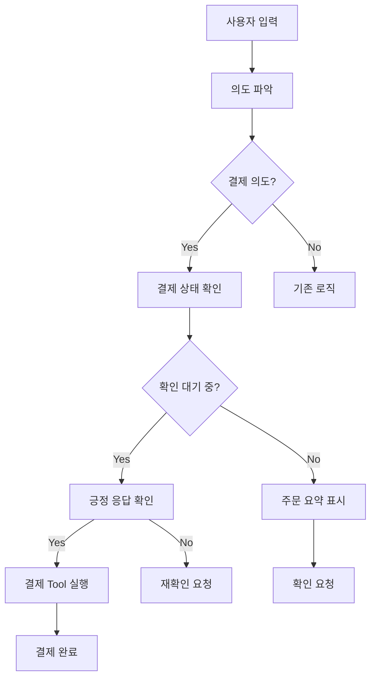

# Design Document

## Overview

현재 음성 키오스크 시스템에서 결제 확인 단계의 무한반복 문제를 해결하고, 주문 표시 시 세부 옵션을 명확하게 보여주는 기능을 구현합니다. 이 설계는 기존 시스템의 구조를 최대한 활용하면서 최소한의 변경으로 문제를 해결하는 것을 목표로 합니다.

## Architecture

### 현재 시스템 구조 분석

1. **DialogueManager** (`src/conversation/dialogue.py`)
   - `_handle_payment_intent()`: 결제 의도 처리
   - `_generate_contextual_response()`: LLM 기반 응답 생성
   - 현재 결제 확인 후 실제 결제 진행 로직 부재

2. **OrderManager** (`src/order/order.py`)
   - `add_item()`: 주문 항목 추가 (현재 옵션 표시 불완전)
   - `confirm_order()`: 주문 확정 (결제 프로세스 없음)

3. **VoiceKioskPipeline** (`src/main.py`)
   - `process_text_input()`: 텍스트 입력 처리
   - `_format_dialogue_response()`: 응답 포맷팅

### 개선된 아키텍처



## Components and Interfaces

### 1. Payment Tool 추가

새로운 tool을 DialogueManager에 추가하여 결제 프로세스를 처리합니다.

```python
def process_payment(self, order_summary: OrderSummary) -> str:
    """
    결제 프로세스 실행
    
    Args:
        order_summary: 주문 요약 정보
        
    Returns:
        결제 완료 메시지
    """
```

### 2. 결제 상태 관리

DialogueManager에 결제 상태를 추적하는 플래그를 추가합니다.

```python
class DialogueManager:
    def __init__(self, ...):
        self.payment_confirmation_pending: Dict[str, bool] = {}
```

### 3. 주문 표시 개선

OrderManager의 `add_item()` 메서드에서 생성하는 메시지를 개선하여 세부 옵션을 포함합니다.

## Data Models

### 결제 상태 추가

```python
# ConversationContext에 결제 상태 추가
class ConversationContext:
    payment_confirmation_pending: bool = False
    pending_payment_order: Optional[OrderSummary] = None
```

### 주문 항목 표시 개선

기존 OrderResult 메시지 포맷을 개선하여 옵션 정보를 포함합니다.

## Error Handling

### 결제 프로세스 오류

1. **결제 Tool 실행 실패**: 기본 오류 메시지 표시 후 재시도 옵션 제공
2. **주문 상태 불일치**: 주문 상태 재확인 후 적절한 안내
3. **세션 상태 오류**: 세션 재시작 안내

### 상태 관리 오류

1. **결제 상태 불일치**: 상태 초기화 후 재시작
2. **컨텍스트 손실**: 새로운 세션 생성

## Testing Strategy

테스트는 생략하고 직접 구현 및 검증을 통해 기능을 확인합니다.

## Implementation Details

### 1. DialogueManager 수정

#### Payment Tool 추가

```python
def process_payment(self, order_summary: OrderSummary) -> str:
    """결제 프로세스 실행 (print문으로 시뮬레이션)"""
    print("결제를 진행합니다...")
    time.sleep(1)
    print("카드를 삽입해 주세요...")
    time.sleep(1)
    print("결제 승인 중...")
    time.sleep(1)
    print("결제가 완료되었습니다!")
    
    return f"결제가 완료되었습니다. 총 {order_summary.total_amount:,}원이 결제되었습니다."
```

#### 결제 의도 처리 로직 개선

`_handle_payment_intent()` 메서드를 수정하여:
1. 결제 확인 상태 관리
2. 긍정 응답 시 결제 Tool 실행
3. 상태 초기화

### 2. OrderManager 수정

#### 주문 추가 메시지 개선

`add_item()` 메서드의 성공 메시지를 다음과 같이 개선:

```python
# 기존
message=f"{item_name} {quantity}개가 주문에 추가되었습니다."

# 개선
option_text = ""
if options and "type" in options:
    option_text = f" {options['type']}"
message=f"{item_name}{option_text} {quantity}개가 주문에 추가되었습니다."
```

### 3. 응답 생성 로직 개선

`_generate_order_success_response()` 메서드를 수정하여 세부 옵션 정보를 포함합니다.

## Security Considerations

1. **결제 정보 보안**: 실제 결제 정보는 처리하지 않으며, 시뮬레이션만 수행
2. **세션 격리**: 각 세션의 결제 상태가 다른 세션에 영향을 주지 않도록 보장
3. **상태 초기화**: 결제 완료 후 민감한 상태 정보 즉시 정리

## Performance Considerations

1. **메모리 사용**: 결제 상태 정보는 최소한으로 유지
2. **응답 시간**: 결제 시뮬레이션 시간을 적절히 조절
3. **상태 정리**: 완료된 결제 상태는 즉시 정리하여 메모리 누수 방지

## Deployment Considerations

1. **기존 시스템 호환성**: 기존 기능에 영향을 주지 않는 방식으로 구현
2. **점진적 배포**: 결제 기능을 단계적으로 활성화
3. **롤백 계획**: 문제 발생 시 이전 버전으로 쉽게 복구 가능한 구조