# 🎤 음성 키오스크 파이프라인 & 신뢰도 알고리즘 분석

## 📖 목차
1. [전체 시스템 아키텍처](#전체-시스템-아키텍처)
2. [파이프라인 플로우](#파이프라인-플로우)
3. [신뢰도 및 판단 알고리즘](#신뢰도-및-판단-알고리즘)
4. [화자 분리 알고리즘](#화자-분리-알고리즘)
5. [메뉴 매칭 시스템](#메뉴-매칭-시스템)
6. [성능 모니터링](#성능-모니터링)

---

## 🏗️ 전체 시스템 아키텍처

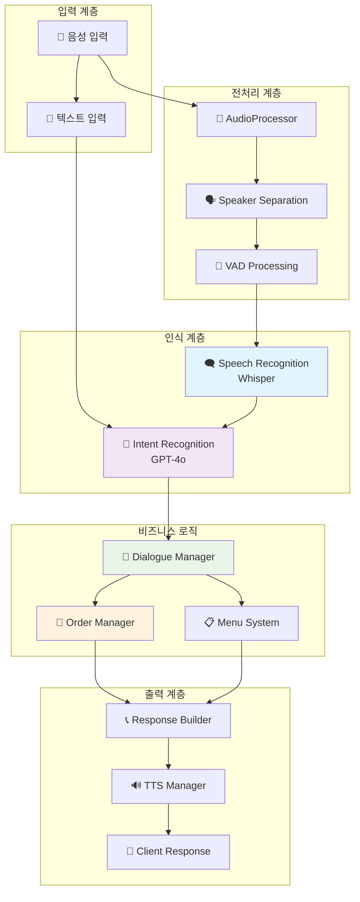

---

## 🔄 파이프라인 플로우

### 전체 처리 흐름

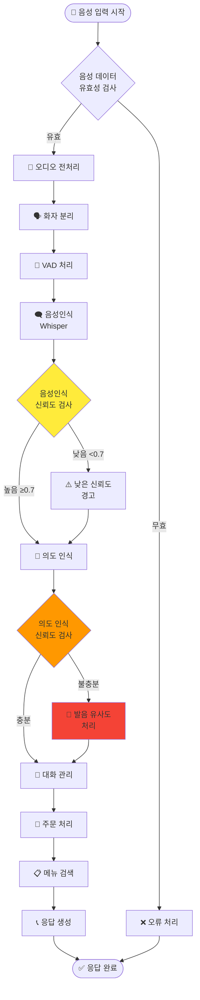

---

## 🎯 신뢰도 및 판단 알고리즘

### 1. 음성 인식 신뢰도 계산

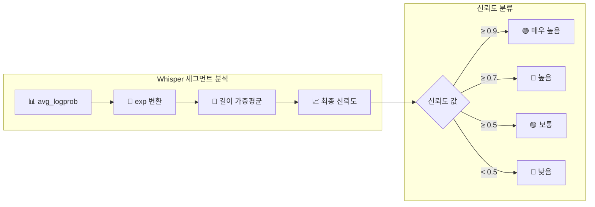

**알고리즘 상세:**
```python
def _calculate_confidence(self, segments: list) -> float:
    total_confidence = 0.0
    total_length = 0
    
    for segment in segments:
        # 로그 확률을 실제 확률로 변환
        avg_logprob = segment.get("avg_logprob", -1.0)
        segment_confidence = min(1.0, max(0.0, np.exp(avg_logprob)))
        
        # 세그먼트 길이로 가중평균
        segment_length = len(segment.get("text", ""))
        total_confidence += segment_confidence * segment_length
        total_length += segment_length
    
    return total_confidence / total_length if total_length > 0 else 0.5
```

### 2. 의도 인식 임계값 시스템

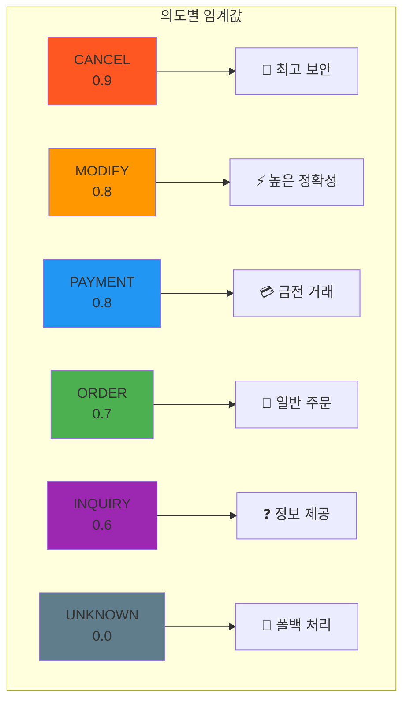

**임계값 설정 논리:**
- **CANCEL (0.9)**: 잘못된 취소 방지 - 가장 높은 확신 필요
- **MODIFY/PAYMENT (0.8)**: 주문 변경 및 결제 - 높은 정확성 요구
- **ORDER (0.7)**: 일반 주문 - 표준 임계값
- **INQUIRY (0.6)**: 단순 문의 - 관대한 임계값

---

## 🗣️ 화자 분리 알고리즘

### 고급 AI 모델 기반 분리

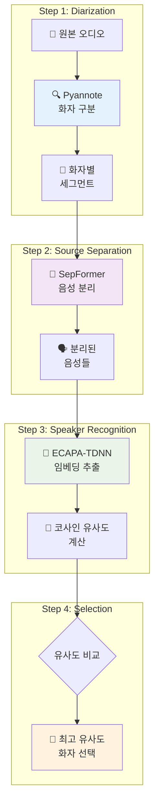

### 유사도 계산 메커니즘

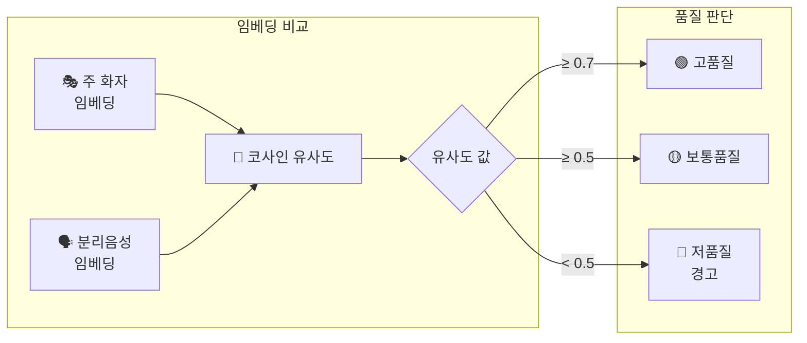

**코사인 유사도 공식:**
```python
similarity = torch.nn.functional.cosine_similarity(
    main_speaker_embedding, separated_embedding, dim=0
).item()

# 임계값: 0.5 미만 시 품질 경고
if similarity < 0.5:
    print("⚠️ 유사도가 낮음 - 결과 품질 주의")
```

### 폴백 메커니즘

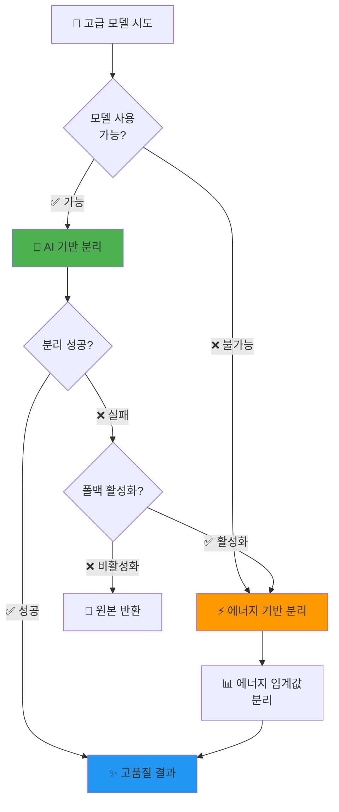

---

## 🔤 발음 유사도 처리 시스템

### LLM 기반 발음 오류 처리

```mermaid
graph TB
    subgraph "입력 처리"
        A[🗣️ 음성인식 결과] --> B{발음 오류<br/>감지}
    end
    
    subgraph "LLM 프롬프트 처리"
        B -->|오류 있음| C[🧠 GPT-4o<br/>유사도 분석]
        B -->|정확함| D[✅ 직접 처리]
        
        C --> E[📝 발음 패턴<br/>매칭]
        E --> F[🔄 의미 변환]
    end
    
    subgraph "예시 변환"
        G["본품" → "단품"]
        H["휴지" → "취소"]
        I["베그맥" → "빅맥"]
    end
    
    F --> G
    F --> H
    F --> I
    
    style C fill:#e1f5fe
    style E fill:#f3e5f5
```

**발음 유사도 프롬프트 지침:**
```
- 발음 유사도를 고려하여 가장 적절한 의도 선택
- 발음 유사도가 70% 이상인 경우 가장 유사한 의미로 이해
- 이상한 단어 = 유사한 실제 단어로 자동 변환
```

---

## 🍔 메뉴 매칭 시스템

### 검색 알고리즘 계층

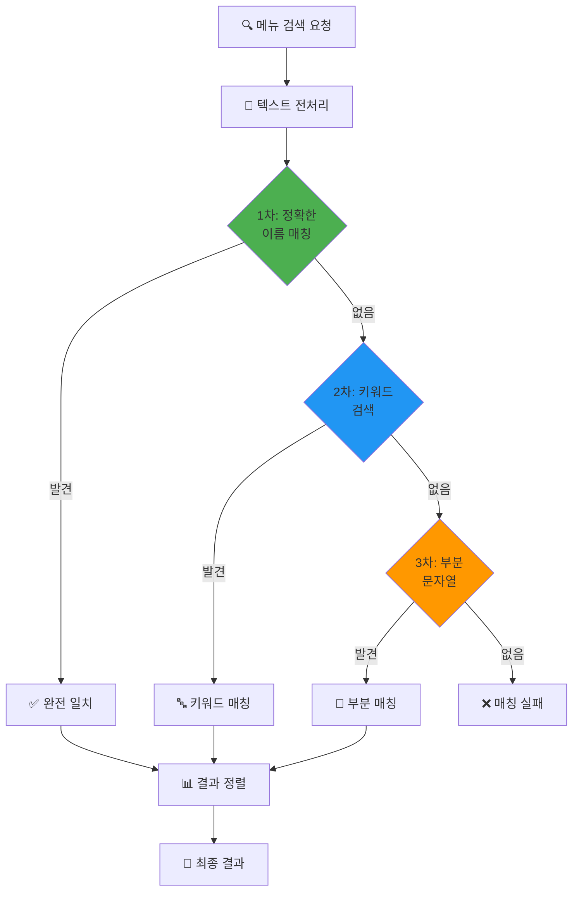

### 키워드 추출 알고리즘

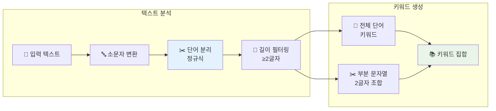

**키워드 추출 예시:**
```
입력: "빅맥세트"
→ 키워드: {"빅맥세트", "빅맥", "맥세", "세트"}

입력: "Big Mac"
→ 키워드: {"big", "mac", "bi", "ig", "ma", "ac"}
```

---

## 📊 성능 모니터링 & 분석

### 신뢰도 분포 분석

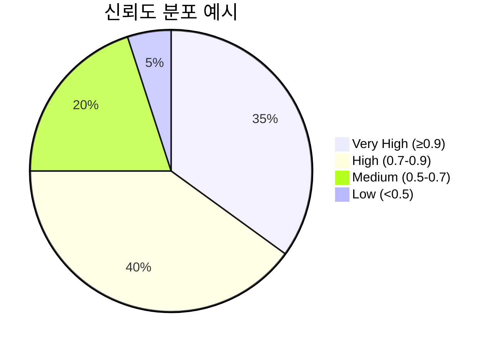

### 처리 시간 성능 지표

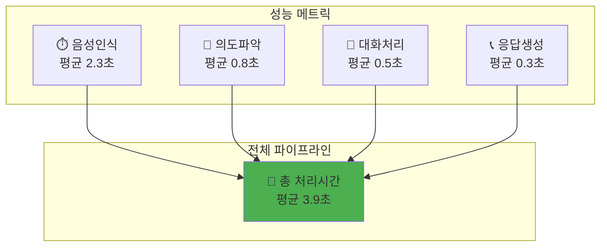

### 오류 처리 흐름

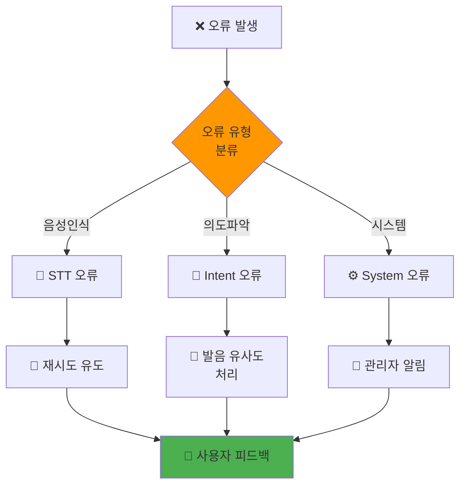

---

## 🎛️ 시스템 설정 & 임계값

### 주요 설정값

| 구분 | 파라미터 | 기본값 | 설명 |
|------|----------|--------|------|
| 음성인식 | confidence_threshold | 0.5 | 음성인식 최소 신뢰도 |
| 화자분리 | speaker_similarity | 0.5 | 화자 유사도 임계값 |
| VAD | vad_threshold | 0.2-0.25 | 음성 활동 감지 민감도 |
| 의도인식 | order_confidence | 0.7 | 주문 의도 임계값 |
| 의도인식 | cancel_confidence | 0.9 | 취소 의도 임계값 |
| 발음처리 | pronunciation_similarity | 70% | 발음 유사도 기준 |

### 환경별 최적화

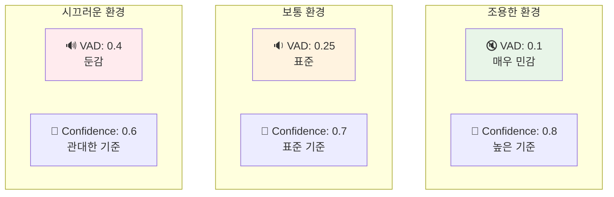

---

## 🎯 핵심 특징 요약

### 💡 시스템 강점

1. **다층적 신뢰도 관리**: 각 처리 단계별 독립적 신뢰도 검증
2. **적응적 임계값**: 의도별 위험도에 따른 차등 기준 적용
3. **지능적 폴백**: 고급 모델 실패 시 기본 알고리즘 자동 전환
4. **LLM 기반 유연성**: 발음 오류를 자연어 이해로 처리
5. **실시간 모니터링**: 성능 지표 및 오류율 지속적 추적

### 🔄 지속적 개선 포인트

- 화자별 학습 데이터 축적으로 개인화 향상
- 환경 조건별 동적 임계값 조정
- 멀티모달 입력 지원 (음성 + 제스처)
- 감정 분석 기반 서비스 품질 향상

---

*이 문서는 음성 키오스크 시스템의 전체 파이프라인과 신뢰도 알고리즘을 종합적으로 분석한 기술 문서입니다.*